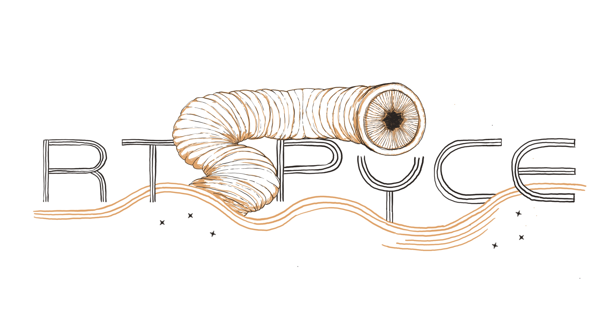

_Made by Evaelle Clerson._

Welcome to RTSPyCE (Ray Tracing Simulation in python of circumstellar environments) !

_Warning: the documentation is being written and does not currently review all the features you could use._

# Where to start ?

The [Wiki](https://gitlab.oca.eu/jperdigon/rtspyce/-/wikis/home) contains all informations you need to install the package and start to write your own models.

If you have any questions or if you need help, you can contact me by mail at jeremy.perdigon@oca.eu
